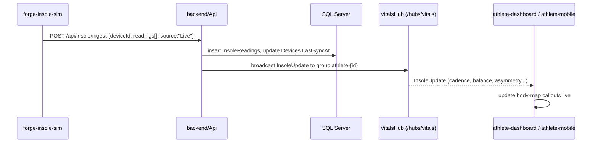
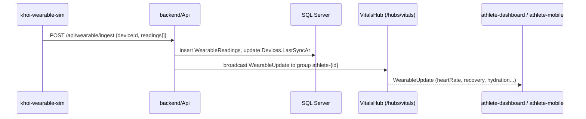
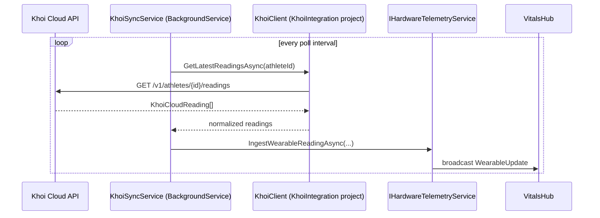
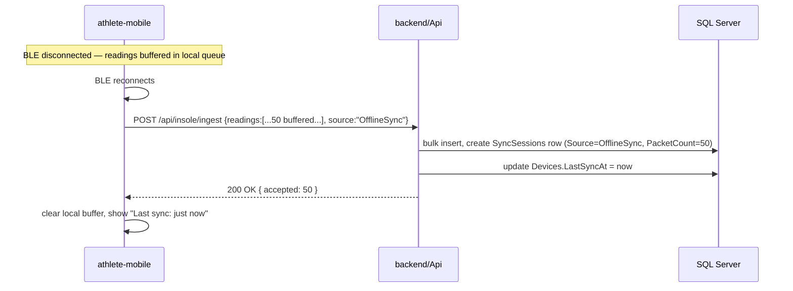

# Data Flow

## Live session (insole simulator or real device connected)

## Live session (wearable simulator)

## Real Khoi Cloud path (future, currently disabled)

## Offline sync (insole reconnects after buffering)

